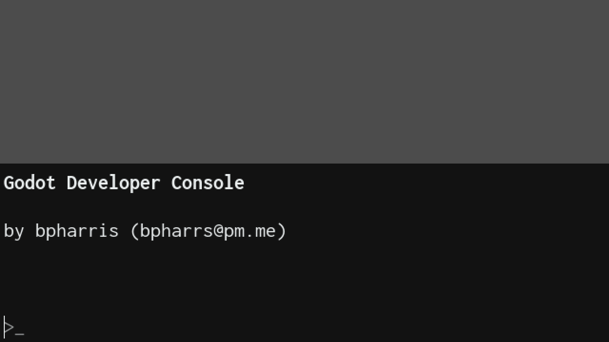
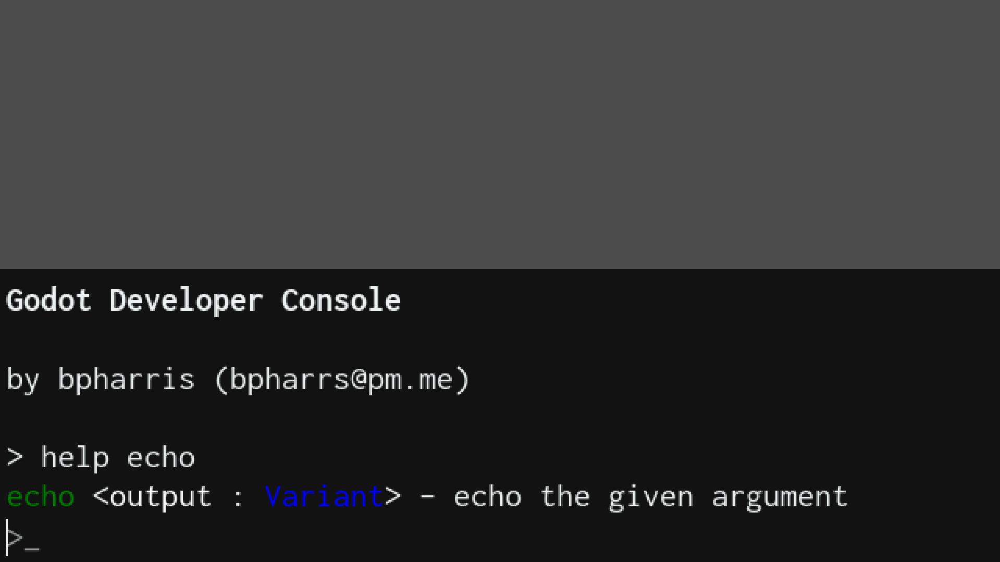
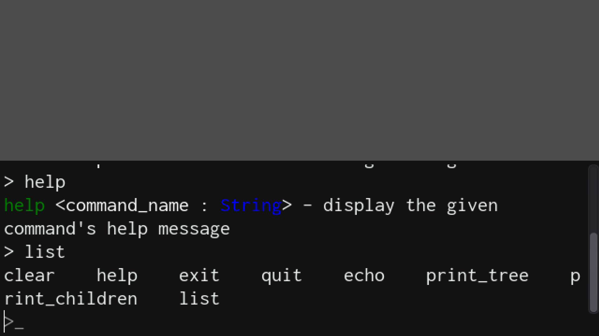
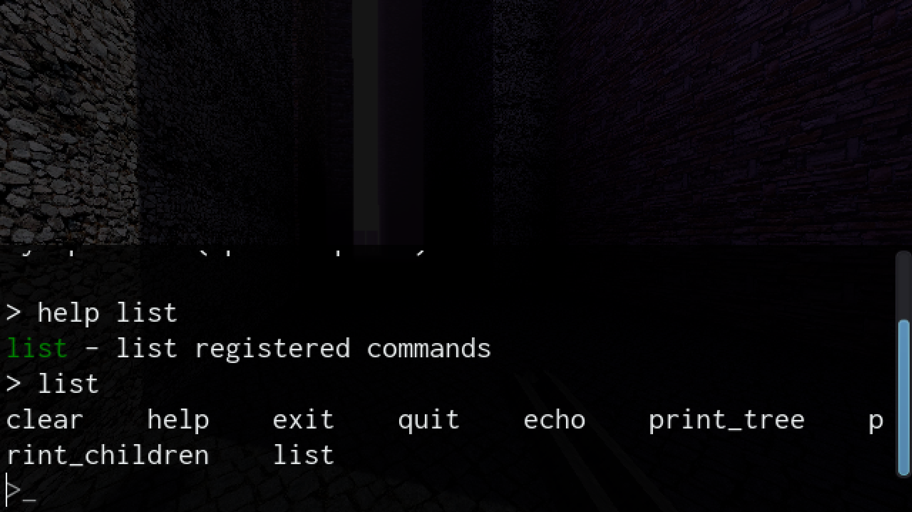
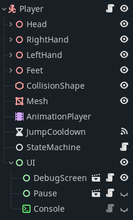

# godot-console <!-- omit in toc -->
An easy-to-use Source Engine inspired game console for Godot with autocomplete and the ability to manipulate Godot `Node` s.

- [Examples](#examples)
  - [Empty Scene Examples](#empty-scene-examples)
  - [In Game Example](#in-game-example)
- [Adding to a Godot Project](#adding-to-a-godot-project)
- [Usage](#usage)
- [Adding Custom Commands](#adding-custom-commands)
- [Command Argument Types](#command-argument-types)
- [Default Commands](#default-commands)
- [Future](#future)
- [LICENSE](#license)

# Examples
**NB: These Examples are from a stylistically-lowres game! The font will *not* be pixelated or fuzzy under normal use. The font used is a standard true type font (Inconsolata, similar to Microsoft's Consolas).**


## Empty Scene Examples




## In Game Example


# Adding to a Godot Project
1. If you don't already have an `addon` folder in your Godot project create one (`res://addons/`)
2. Submodule this repository into `res://addons/godot_console`, from `res://` (project root) run:
    ```
    git submodule add https://github.com/bpharris/godot-console.git addons/godot_console/
    ```
    NB: The addon folder must be `godot_console` verbatim or Godot will not correctly register the plugin.
3. For the `Console` to work you will also need to create an `autoload` script called `Globals` and add to it the following:
    
    ```var console_commands := {}```

    I would recommend having a `Globals.gd` autoload regardless of the use of the `Console` as it allows one to track values across scenes (such as a player inventory, etc), though one should obviously be conservative about what one puts in the global autoload.

4. In your Godot project go to `Project > Project Settings... > Plugins` and set the console to active.
5.  To add the console to a scene click create a new child node (as you would with a native Godot node such as `KinematicBody2D`, **not** an instanced scene) and search for console. Select the listed `Console` node and click 'Create'. NB: The `Console` node should be under `Node > CanvasItem > Control > Console`.
    
    NB: It is recommended you add it to your Player UI/HUD so that a singular console is accessible in all scences. For example:
    ```
    Player (Type: KinematicBody)
    ├─ Mesh
    ├─ AnimationPlayer
    ├─ ...
    └── UI  (Type: Control)
        ├─ ...
        ├─ ...
        └─ Console
    ```
    Image example from a game of mine:
    
    
    
6. Select the newly created `Console` node and, in the editor, set the layout to 'Full Rect' (`Layout > Full Rect`).
7. Ensure that your Godot project has keys assigned to (`Project > Project Settings... > Input Map`):
    1. 'dev_toggle_console' -- to toggle the console open/closed
    2. 'ui_focus_next' -- to autocomplete   (NB: assigned by TAB default)
    3. 'ui_cancel' -- to close the console   (NB: assigned by ESC default)
    4. 'ui_up' -- to navigate up in command history  (NB: assigned UP by default)
    5. 'ui_down' -- to navigate down in command history  (NB: assigned DOWN by default)
    6. 'ui_enter' -- to enter a command  (NB: assigned by default)
8. Enjoy! 

# Usage
To use the console, simply press the 'dev_toggle_console' key to open the console,
type a command, and press 'ui_enter'. The console comes with a `help` command built-in for help with commands, for example:
    
    > help echo
    echo <output : Variant> - echo the given argument
    > help help
    help <command_name : String> - display the given command's help message

but with prettier colours!

# Adding Custom Commands
Simply call `$console.add_command(`*args*`)` where `$console` is a reference to the
console node. The method implementing the command must return a CommandResponse instance. Below are the exact rules, but they may be a bit confusing at first -- if so take a look at the example and you will see it is quite simple really!

Custom command arguments:
- `name` : The name the command will registered as
- `parent_node` : A refence the node that stores the method that implements the command (usually `self`)
- `method_name` : The name of the method that implements the command (default = `name`)
- `command_arguments` : The names and types of the command/method arguments (default = empty) (type: `Array[Array[argument_name : String, argument_type : Type]]`)
- `description` : A description of the commands function, displayed by the `help` command (default = `'no description given'`)
- `help` : A help string for the command, usually a usage style string (default = automatically derived).
    
    Unless you want to specifically override the automatically generated help string (which is quite good and have highlighting, see the examples in Usage) you should omit this argument.

Type hints omitted in examples for better syntax highlighting on GitHub (though most people don't use them anyways).

Example (given that `console` is a reference to a `Console` node):
```GDScript
func _ready():
    console.add_command(
        'my_command',
        self,
        '_my_command',
        [['x', TYPE_INT], ['s', TYPE_STRING]],
        'this is my custom command'
    )

func _my_command(x, s):
    # Your command logic here
    ...

    # If command with no output
    if no_ouput:
        return CommandResponse.new(CommandResponse.ResponseType.EMPTY)

    # On error
    if error:
        return CommandResponse.new(CommandResponse.ResponseType.ERROR, 'description of error')
    
    return CommandResponse.new(CommandResponse.ResponseType.RESULT, 'result/response as string')
```

For info on the command argument types see the 'Command Argument Types' section below.

Worked example of the `echo` command:
```GDScript
func _ready():
    add_command('echo', self, '_command_echo', [['output', TYPE_NIL]], 'echo the given argument')

func _command_echo(output):
	"""Echo the output string."""
	return CommandResponse.new(CommandResponse.ResponseType.RESULT, str(output)1)
```
In use:
```
> help echo
echo <output : Variant> - echo the given argument
> echo 4
4
> echo test
test
> echo "a long string"
a long string
```

# Command Argument Types
See `./Command/Types.gd` for even more info and implementation.

Argument Types:
- TYPE_NIL          (GDScript `Variant`, i.e. dynamicly typed)
- TYPE_BOOL         (GDScript `bool`, e.g. `true`)
- TYPE_INT          (GDScript `int`, e.g. `4`)
- TYPE_REAL         (GDScript `float`, e.g. `3.2`)
- TYPE_STRING       (GDScript `String`, e.g. `'a sring'`)
- TYPE_NODE_PATH    (GDScript `NodePath`, i.e. a `NodePath()` instance)

The identifiers TYPE_NIL, TYPE_INT, etc are provided by GDScript (as part of `@GlobalScope`) in the enum `Variant.Type`.


# Default Commands
Current:
- `clear` : clears the console output
- `help` : prints the help message to the console
- `exit` : closes the console
- `quit` : quits the game
- `echo` : takes a string and prints it to the console
- `print_tree` : print the full scene tree to the console
- `print_children` : print the given node's children (i.e. print the subtree for which the given node is the root)
- `list` : list the registered commands

Comming soon:
- `info`/`debug`/`warn`/`error` ?
- `bind`/`unbind`


# Future
Todo:
- Remove need for autoload script?
- Implement command history


# LICENSE
See the LICENSE file (MIT License)

Feel free to suggest improvements, contribute code, etc!

If you use the console in your game please let me know! I would love to hear about it. :)
